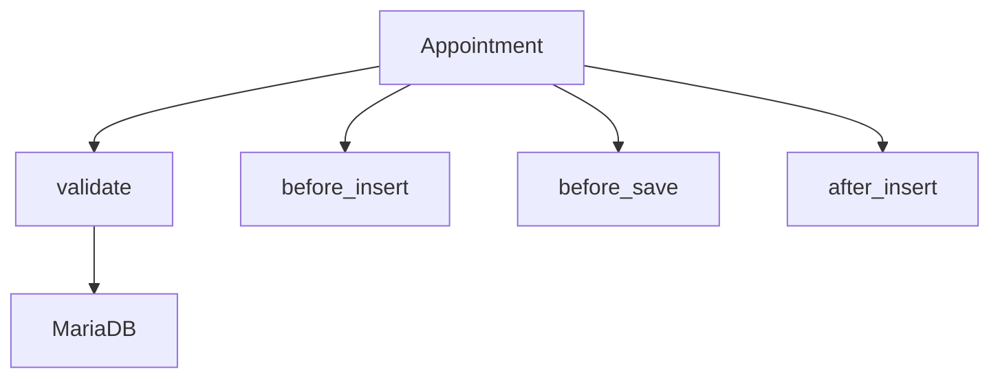

# Appointment Backend

```mermaid
graph TD

Appointment

Appointment --> validate

Appointment --> before_insert

Appointment --> before_save

Appointment --> after_insert

validate --> MariaDB
```
