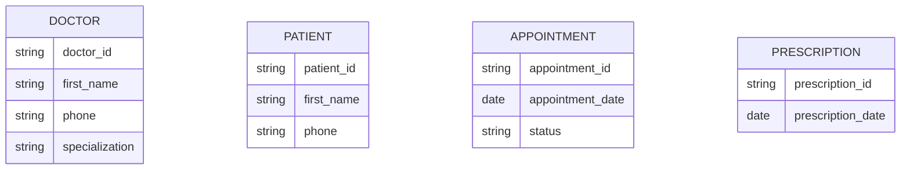

# Database Schema

```mermaid
erDiagram

DOCTOR {
string doctor_id
string first_name
string phone
string specialization
}

PATIENT {
string patient_id
string first_name
string phone
}

APPOINTMENT {
string appointment_id
date appointment_date
string status
}

PRESCRIPTION {
string prescription_id
date prescription_date
}
```
